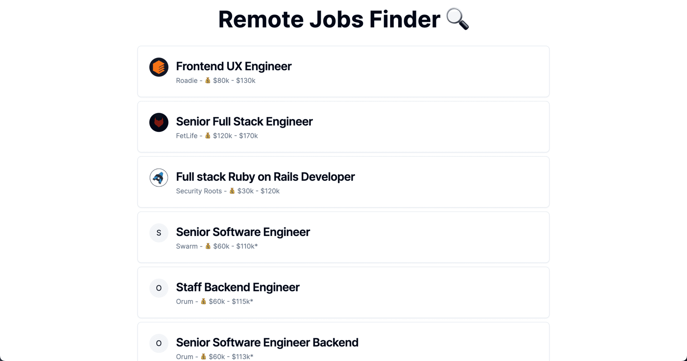

# Remote Jobs Finder



This is a [Next.js](https://nextjs.org/) project that scrapes job offers from [We Wrok Remotely](https://weworkremotely.com/) and [Remote OK](https://remoteok.com/).

## Tech Stack

**Client:** [Next.js](https://nextjs.org/), [TailwindCSS](https://tailwindcss.com/), [Shadcn/ui](https://ui.shadcn.com/)

**ORM:** [Prisma](https://www.prisma.io/)

**Database (Postgres):** [Neon](https://neon.tech/)

**Deployment:** [Vercel](https://vercel.com/)

[Bright Data](https://brightdata.com/) is used for data scraping.

## Installation

First, run the development server:

```bash
npm run dev
# or
yarn dev
# or
pnpm dev
# or
bun dev
```

Open [http://localhost:3000](http://localhost:3000) with your browser to see the result.

## Environment Variables

To run this project, you will need to add the following environment variables to your .env file

`DATABASE_URL`

`BRIGHTDATA_AUTH`

## Deployment

To deploy this project run

```bash
  npm run vercel-build
```
